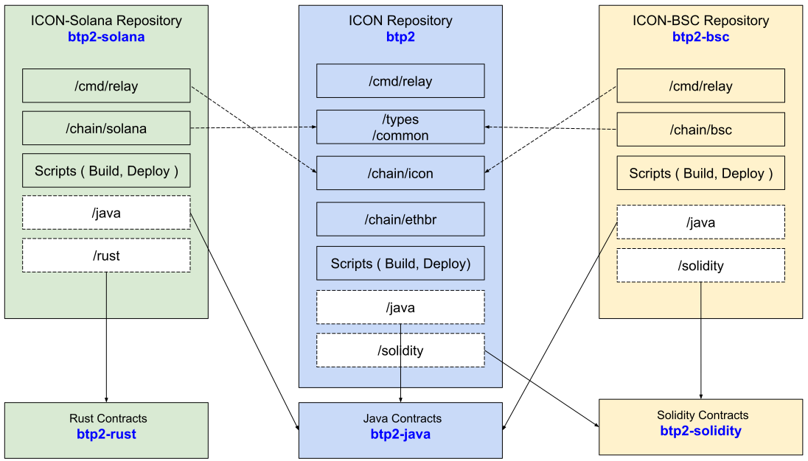

# Relay System for BTP 2.0

## Introduction

This is a reference `relay` implementation for BTP 2.0 protocol.

### Target chains
* ICON (BTP Block)
* Hardhat (EVM-compatible chain)

### Terminologies

| Word            | Description                                                                                                                             |
|:----------------|:----------------------------------------------------------------------------------------------------------------------------------------|
| BTP             | Blockchain Transmission Protocol, see [ICON BTP Standard](https://github.com/icon-project/IIPs/blob/master/IIPS/iip-25.md).             |
| BTP Message     | A verified message which is delivered by the relay                                                                                      |
| Service Message | A payload in a BTP Message                                                                                                              |
| Relay Message   | A message including BTP Messages with proofs for that, and other block update messages.                                                 |
| Network Address | A string to identify blockchain network   *ex) 0x1.icon*                                                                            |
| BTP Address     | A string of URL for locating an account of the blockchain network   *ex) btp://0x1.icon/cx87ed9048b594b95199f326fc76e76a9d33dd665b* |

### Components

* [BTP Message Center (BMC)](https://github.com/icon-project/IIPs/blob/master/IIPS/iip-25.md#btp-message-center) - smart contract
  - Receive BTP messages through transactions.
  - Send BTP messages through events.

* [BTP Message Verifier (BMV)](https://github.com/icon-project/IIPs/blob/master/IIPS/iip-25.md#btp-message-verifier) - smart contract
  - Update blockchain verification information
  - Verify delivered BTP message and decode it

* [BTP Service Handler (BSH)](https://github.com/icon-project/IIPs/blob/master/IIPS/iip-25.md#btp-service-handler) - smart contract
  - Handle service messages related to the service.
  - Send service messages through the BMC

* [BTP Message Relay (BMR)](doc/bmr.md) - external software (implemented by this repository)
  - Monitor BTP events
  - Gather proofs for the events
  - Send BTP Relay Message

## Getting Started
1. `git clone https://github.com/icon-project/btp2.git --recurse-submodules`
2. `cd btp2`
3. `make relay`

## E2E Testing Demo
* Follow the instruction in [End-to-End Testing Demo](e2edemo) folder.

## Repository Structure

## References
* [ICON BTP Standard](https://github.com/icon-project/IIPs/blob/master/IIPS/iip-25.md)
* [ICON Docs - Sending a message with xCall](https://docs.icon.community/cross-chain-communication/xcall/sending-a-message-with-xcall)
